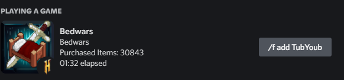

<div id="top"></div>

<div align="center">
<a href="https://github.com/TubYoub/HyDRP">
    
</div>

<div align="center">
    <a href="https://github.com/TubYoub/HyDRP/issues">Report Bug</a>
</div>


<!-- TABLE OF CONTENTS -->
<details>
  <summary>Table of Contents</summary>
  <ol>
    <li>
      <a href="#about-the-project">About The Project</a>
    </li>
    <li>
      <a href="#getting-started">Getting Started</a>
    </li>
    <li><a href="#usage">Usage</a></li>
    <li><a href="#supported-games">Supported Minigames</a></li>
    <li><a href="#roadmap">Roadmap</a></li>
    <li><a href="#license">License</a></li>
    <li><a href="#contact">Contact</a></li>
  </ol>
</details>


<!-- ABOUT THE PROJECT -->
## About The Project

This is a console based program for Minecraft Players who are playing on the Minecraft Server [Hypixel](https://hypixel.net/)
<p align="right">(<a href="#top">back to top</a>)</p>


<!-- GETTING STARTED -->
## Getting Started

At first you have to download and unzip the  ```HyDRP-0.2.1.zip```.

1. When you run the HyDRP.exe for the Firsttime you will be asked to put in your Minecraft Username and your API key fom Hypixel.
<br>(You can get your API key by typing ```/api new``` into the [Hypixel](https://hypixel.net/) Chat)
2. When you do want that the Updates of your DRP beeing printed to your console 
<br> than you have to edit the ```config.ini``` and set ```print_the_console``` from ```False``` to ```True```

<p align="right">(<a href="#top">back to top</a>)</p>


<!-- USAGE EXAMPLES -->
## Usage

The usage of this Program is to display what minigame you are playing on the [Hypixel](https://hypixel.net/) Server Network.
<br> it will display stats from Minigame. For Example in Bedwars:
<br> 
<br> There is also a Button which say's ```/f add <name>``` when you press it you will get to the Players Stats. Note: This Button does not function in the Discord Client of the Person who uses HyDRP.
<p align="right">(<a href="#top">back to top</a>)</p>


## Supported Games

Here is list of Hypixel Minigames which are currently supported
- Bedwars
- Skywars
- Murder Mystery
- Turbo CartRacer
- Duels
- The Pit
- other Gamemodes will displayed as "playing minigames on: mc.hypixel.net"
  
  

<!-- ROADMAP -->
## Roadmap

- [ ] Disable certain Stats
- [ ] Support more Minigames
- [ ] a GUI

See the [open issues](https://github.com/github_username/repo_name/issues) for a full list of proposed features (and known issues).

<p align="right">(<a href="#top">back to top</a>)</p>

<!-- LICENSE -->
## License

Distributed under the MIT License. See `LICENSE` for more information.

<p align="right">(<a href="#top">back to top</a>)</p>


<!-- CONTACT -->
## Contact

TubYoub - Discord: TubYoub#0069

Project Link: [https://github.com/TubYoub/HyDRP](https://github.com/TubYoub/HyDRP)

<p align="right">(<a href="#top">back to top</a>)</p>
